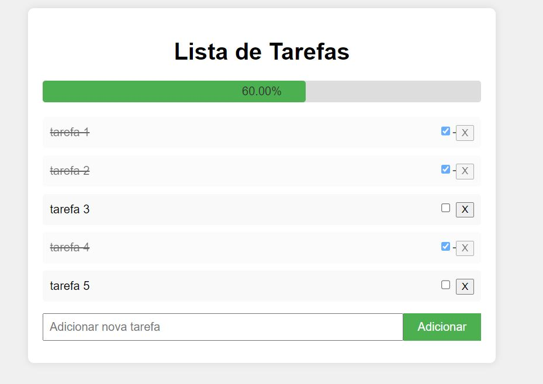

# Aplicativo de Lista de Tarefas com Gráfico de Progresso

Este é um aplicativo simples de lista de tarefas desenvolvido utilizando HTML, CSS e JavaScript. Ele permite que você gerencie suas tarefas diárias, marcando-as como concluídas, removendo tarefas e visualizando o progresso geral através de um gráfico de barras.

## Funcionalidades

- Adicionar novas tarefas à lista.
- Marcar tarefas como concluídas.
- Excluir tarefas da lista.
- Visualizar a porcentagem de tarefas concluídas através de um gráfico de barra.

## Tecnologias Utilizadas

- HTML5
- CSS3
- JavaScript (ES6)

## Como Usar

1. **Adicionar Tarefas:**
   - Digite o nome da nova tarefa no campo de texto.
   - Clique no botão "Adicionar" ou pressione Enter para adicionar a tarefa à lista.

2. **Marcar Tarefa como Concluída:**
   - Clique na caixa de seleção ao lado da tarefa na lista para marcá-la como concluída.
   - A tarefa marcada como concluída será exibida com uma linha através do texto.

3. **Excluir Tarefa:**
   - Cada tarefa possui um botão "X" à direita para excluí-la da lista.
   - Clique no botão "X" para remover a tarefa da lista.

4. **Visualizar Progresso:**
   - Uma barra de progresso exibe a porcentagem de tarefas concluídas em relação ao total de tarefas na lista.
   - A porcentagem é atualizada dinamicamente conforme você marca tarefas como concluídas ou as remove da lista.

## Como Instalar e Executar

1. Clone este repositório:
