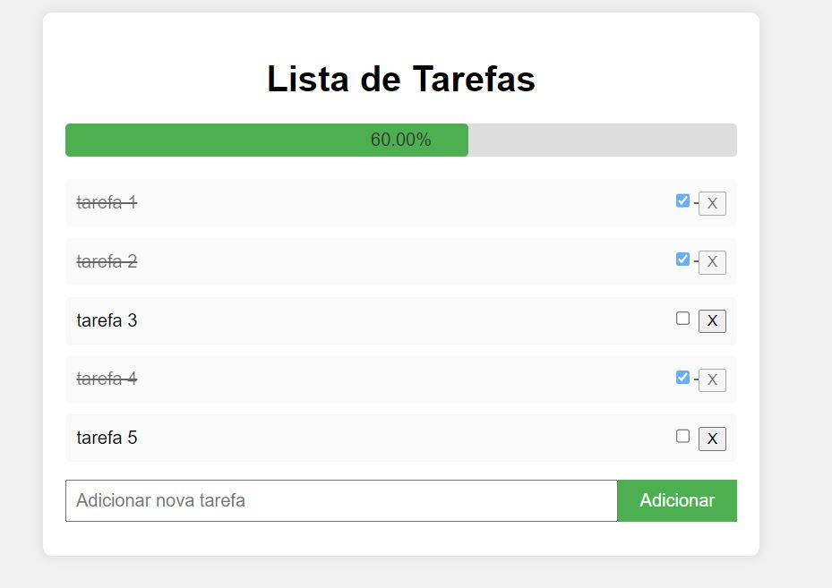

# Aplicativo de Lista de Tarefas com Gráfico de Progresso

Este é um aplicativo simples de lista de tarefas desenvolvido utilizando HTML, CSS e JavaScript. Ele permite que você gerencie suas tarefas diárias, marcando-as como concluídas, removendo tarefas e visualizando o progresso geral através de um gráfico de barras.

## Funcionalidades

- Adicionar novas tarefas à lista.
- Marcar tarefas como concluídas.
- Excluir tarefas da lista.
- Visualizar a porcentagem de tarefas concluídas através de um gráfico de barra.
- Salva seus dados via localStorage

## Tecnologias Utilizadas

- HTML5
- CSS3
- JavaScript (ES6)

## Como Usar

1. **Adicionar Tarefas:**
   - Digite o nome da nova tarefa no campo de texto.
   - Clique no botão "Adicionar" ou pressione Enter para adicionar a tarefa à lista.

2. **Marcar Tarefa como Concluída:**
   - Clique na caixa de seleção ao lado da tarefa na lista para marcá-la como concluída.
   - A tarefa marcada como concluída será exibida com uma linha através do texto.

3. **Excluir Tarefa:**
   - Cada tarefa possui um botão "X" à direita para excluí-la da lista.
   - Clique no botão "X" para remover a tarefa da lista.

4. **Visualizar Progresso:**
   - Uma barra de progresso exibe a porcentagem de tarefas concluídas em relação ao total de tarefas na lista.
   - A porcentagem é atualizada dinamicamente conforme você marca tarefas como concluídas ou as remove da lista.

## Acessar:

1. Acesse:  https://flaviojunior94.github.io/lista-de-tarefas/

## VERSÃO 2.0

### 🚀 Principais Melhorias Implementadas

#### ✏️ **Edição de Tarefas**
- **Funcionalidade:** Agora é possível editar tarefas existentes sem precisar excluí-las
- **Como usar:** Clique no ícone de lápis (✏️) ao lado da tarefa
- **Recursos:** Campo de edição inline com botões de salvar/cancelar
- **Atalhos:** Enter para salvar, Escape para cancelar

#### 📋 **Duplicação de Tarefas**
- **Funcionalidade:** Crie cópias de tarefas existentes rapidamente
- **Como usar:** Clique no ícone de cópia (📋) ao lado da tarefa
- **Benefício:** Ideal para tarefas recorrentes ou similares
- **Detalhe:** Nova tarefa é criada com "(cópia)" no final e sempre desmarcada

#### ↕️ **Reordenação de Tarefas**
- **Funcionalidade:** Organize suas tarefas na ordem de prioridade desejada
- **Como usar:** Use as setas ⬆️ e ⬇️ para mover tarefas
- **Inteligência:** Botões desabilitados automaticamente quando não há para onde mover
- **Persistência:** Ordem mantida no localStorage

#### 🎨 **Design Modernizado**
- **Interface:** Visual completamente renovado com design moderno
- **Ícones:** Integração com Font Awesome para ícones profissionais
- **Efeitos:** Animações suaves, hover effects e transições
- **Paleta:** Cores frias e gradientes elegantes
- **Tipografia:** Título estilizado com gradiente e linha decorativa

#### 🌈 **Barra de Progresso Inteligente**
- **Cores Dinâmicas:** A barra muda de cor conforme o progresso
  - 🔴 **0-20%:** Vermelho (Início)
  - 🟠 **20-40%:** Laranja (Progredindo)
  - 🟡 **40-60%:** Amarelo (Meio caminho)
  - 🔵 **60-80%:** Azul (Quase lá)
  - 🟢 **80-100%:** Verde (Sucesso!)

#### 🔧 **Melhorias de UX/UI**
- **Botões Otimizados:** Espaçamento adequado para evitar cliques acidentais
- **Tooltips:** Dicas informativas em cada botão
- **Responsividade:** Interface adaptável para diferentes dispositivos
- **Feedback Visual:** Estados claros para todas as interações

#### 💾 **Tecnologias Mantidas**
- **Frontend Puro:** 100% JavaScript vanilla, sem dependências externas
- **LocalStorage:** Todos os dados continuam salvos localmente
- **Sem Backend:** Projeto completamente independente
- **Performance:** Carregamento rápido e operações instantâneas

### 🎯 **Benefícios da Versão 2.0**
- ⚡ **Produtividade:** Edição e duplicação aceleram o gerenciamento
- 🎨 **Experiência:** Interface mais intuitiva e visualmente atraente
- 📊 **Motivação:** Barra colorida incentiva o progresso
- 🔄 **Flexibilidade:** Reordenação permite priorização dinâmica
- 🛡️ **Confiabilidade:** Todas as funcionalidades mantêm a persistência de dados
